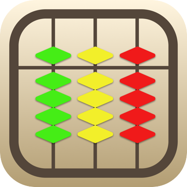

<h1 align="center">Abhigyan Jaiswal</h1>

  Student developer in Tokyo building thoughtful applications across Apple platforms, automation, and education.

  <a href="#featured-project">Featured Project</a> ·
  <a href="#selected-work">Selected Work</a> ·
  <a href="mailto:abhigyanjj@gmail.com">Contact</a>

---

## Featured Project

  

<h3 align="center">Soroban: Mental Math Abacus</h3>

<strong>Winner of the Apple Swift Student Challenge 2026</strong>

Soroban began as my Swift Student Challenge project and grew into a complete learning app for iPhone and iPad. It helps students learn the Japanese abacus and develop mental-math speed through guided lessons, Flash Anzan, daily challenges, practice drills, and progress tracking.

  

## Selected Work

<table>
  <tr>
    <td width="50%" valign="top">
      <h3><a href="https://github.com/abhigyanj/automation-app">Automation Studio</a></h3>
      
First built in sixth grade without AI, then revisited years later and refined in a single Codex pass into a safer, cleaner visual automation builder.

      Python · Tkinter
    </td>
    <td width="50%" valign="top">
      <h3><a href="https://github.com/abhigyanj/english-tutor">Tutor Website</a></h3>
      
A full-stack English tutoring platform with tutor discovery, Stripe payments, time-zone-aware scheduling, waitlist matching, session tracking, and moderation.

      React · Flask · PostgreSQL
    </td>
  </tr>
</table>

## Technologies

  Swift · SwiftUI · Python · TypeScript · React · Git

---

  <a href="mailto:abhigyanjj@gmail.com">Email</a> ·
  <a href="https://www.linkedin.com/in/abhigyanj/">LinkedIn</a>

